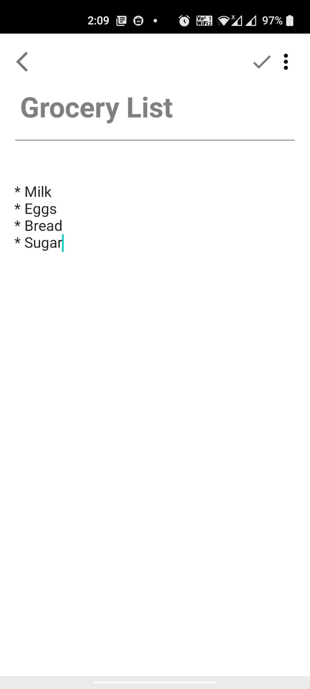
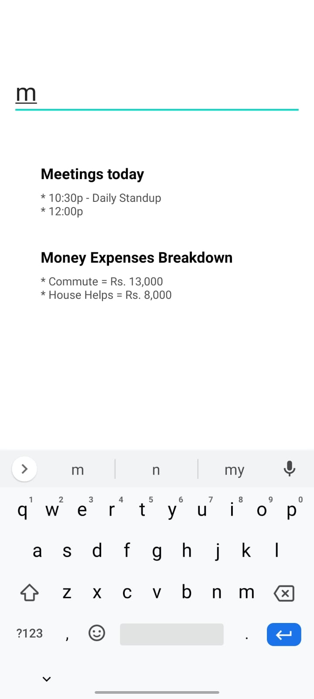
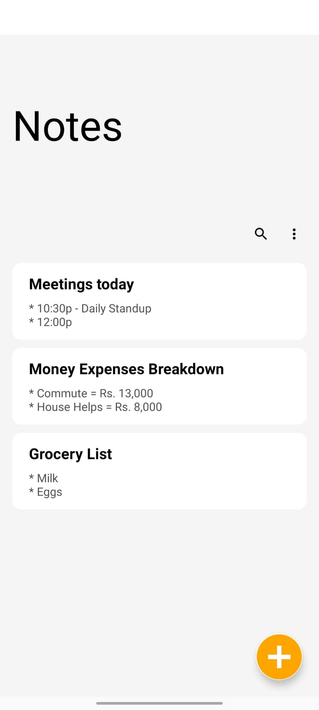

# NotesApp

This is demo Notes Saving project

* One can write notes and save it for later review.
* One can search the previous written notes.
* One can see the list of all notes on home page.
* This app uses room for caching.
* Follows MVVM(Model-View-ViewModel) archietecture.

  

